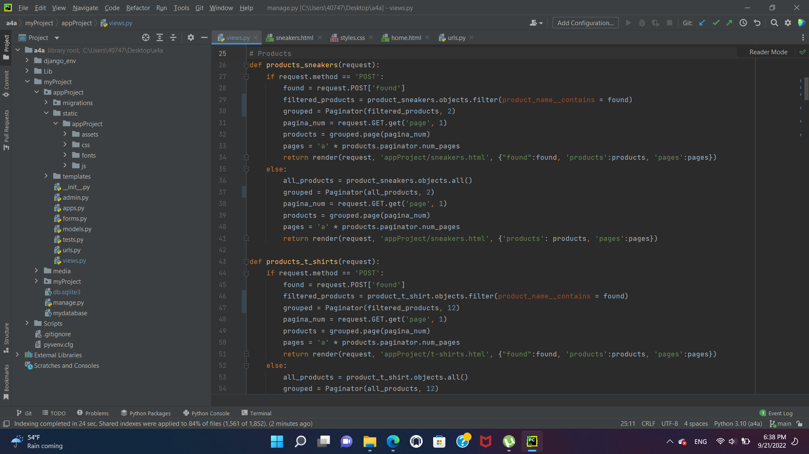
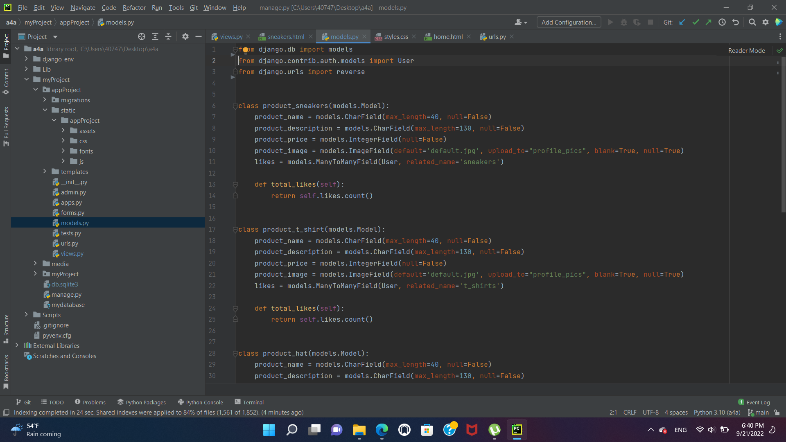
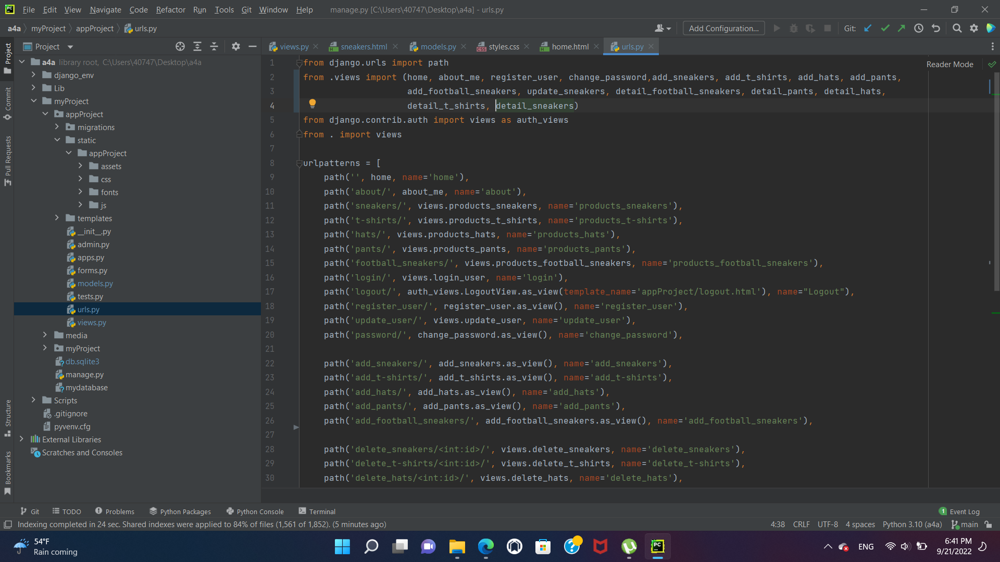
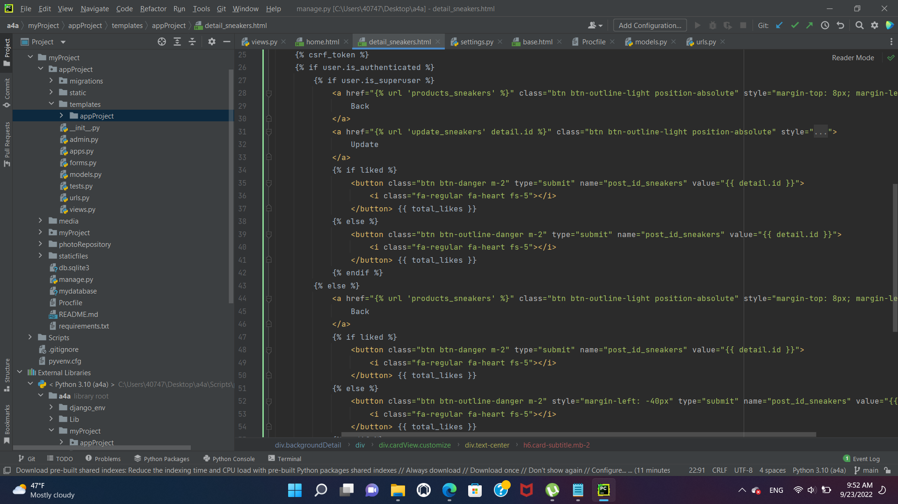
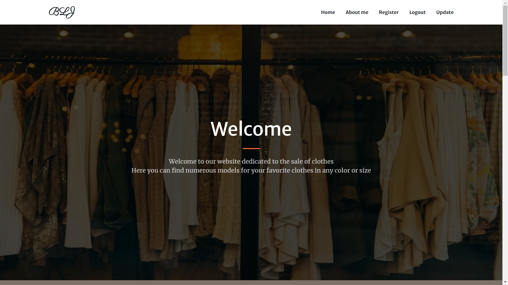
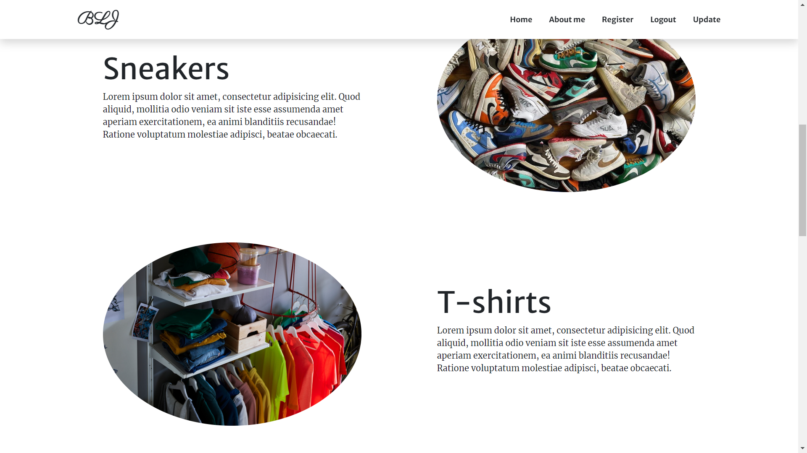
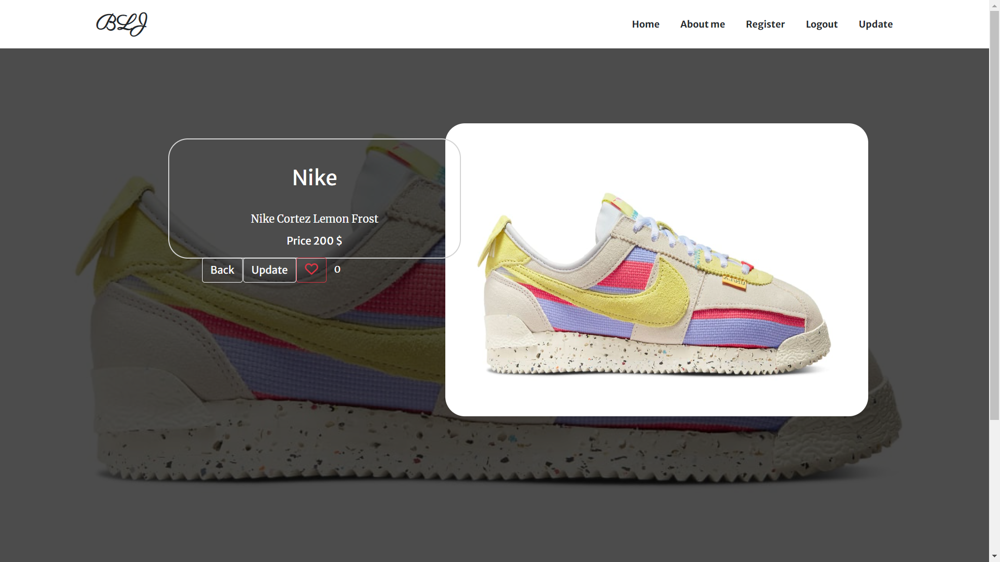

# Django project
[Website Django](https://django-project-by-blj.herokuapp.com/)

## Despre proiect
Prin acest proiect doresc sa expun cunostintele mele pe partea de FrontEnd si nu numai.
Prin intermediu acestui proiect am cautat sa folosesc in mare parte framework-ul Django si sa incerc sa evidentiez functionalitatile acestuia.
Acest proiect este un magazin online de haine, unde, clientul vine si isi alege hainele si incaltamintele favorite pe diferite marimi si culori. Acest proiect are o zona de inregistratre, de actualizare, adaugare de produse noi si alte functionalitati.

## Tehnologiile folosite
* CSS
* Python
* Django
* HTML
* JavaScript

## Lista de sarcini
- [x] creare pagina 'home'
- [x] creare pagina 'about me'
- [x] creare zona de inregistrare
- [x] creare zona de adaugare
- [x] creare zona de actualizare
- [x] creare zona de schimbare a parolei 
- [x] buton de adaugare
- [x] zona de cautare
- [x] minimizarea dimensiunilor pozelor
- [ ] creare zona de trimitere a mesajelor
- [ ] adauga in baza de date o zona pentru specificarea marimilor produselor
- [ ] creare cos de cumparaturi

## Cateva imagini din culisele proiectului

## Cateva imagini din partea de FrontEnd

## Contact
[Linkedin](https://www.linkedin.com/in/razvan-blajan-35255a235/) 
[Facebook](https://www.facebook.com/razvan.blajan.96/) 
[Instagram](https://www.instagram.com/r_blajan/) 
